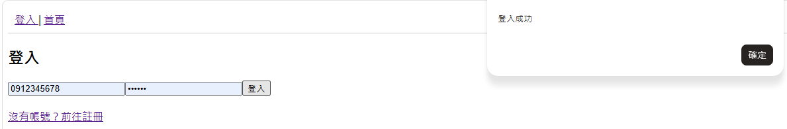
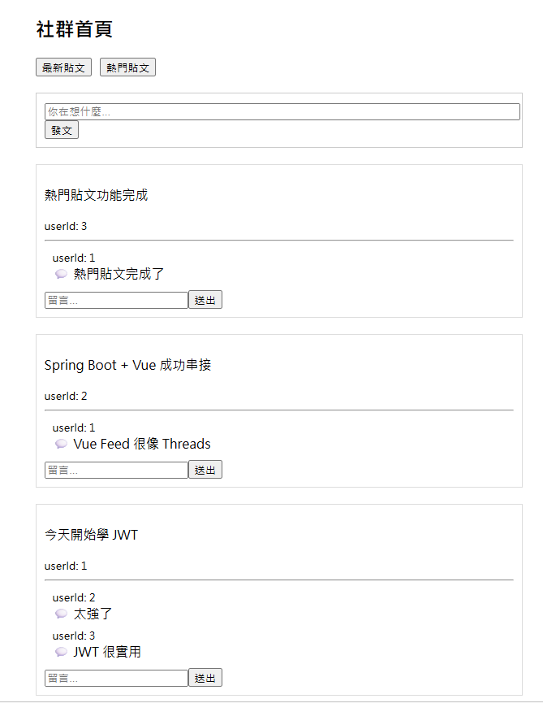

# Social Media System

簡易社群媒體平台，使用 Vue.js + Spring Boot + MySQL 建立。

---

# 專案介紹

本專案為前後端分離的社群媒體系統，使用 JWT 進行身份驗證，並實作貼文、留言、熱門貼文排序等功能。

前端使用 Vue.js 建立 Feed 社群頁面，後端使用 Spring Boot 提供 RESTful API。

---

# 功能介紹

## 使用者功能

- 手機號碼註冊
- JWT 登入驗證
- 註冊後自動登入
- 登出功能

---

## 貼文功能

- 新增貼文
- 顯示最新貼文
- 顯示熱門貼文
- Enter 快捷發文

### 這兩項尚未在前端實現，只有透過API呼叫
- 編輯貼文
- 刪除貼文

---

## 留言功能

- 新增留言
- 顯示留言列表
- Enter 快捷留言

---

## Feed 功能

- 社群首頁 Feed
- 最新 / 熱門貼文切換
- 即時刷新留言
- JWT 自動帶入 userId
- 留言局部刷新避免 在熱門貼文模式時Feed 跳動影響體驗

---

# 技術架構

## Frontend

- Vue.js
- Vue Router
- Axios

---

## Backend

- Spring Boot
- Spring Security
- JWT Authentication
- JPA (Hibernate)
- RESTful API

---

## Database

- MySQL
- Stored Procedure

---

# 安全機制

- JWT 身份驗證
- XSS 防護（HtmlEscape）
- Validation 驗證
- Transaction 管理
- 不信任前端 userId（從 JWT 取得）

---

# 系統架構

Frontend (Vue.js)

↓

RESTful API

↓

Spring Boot

↓

MySQL

---

# 資料庫設計

## users

| 欄位 | 型別 |
|---|---|
| user_id | INT |
| user_name | VARCHAR |
| phone | VARCHAR |
| email | VARCHAR |
| password | VARCHAR |
| biography | TEXT |
| created_at | DATETIME |

---

## posts

| 欄位 | 型別 |
|---|---|
| post_id | INT |
| content | TEXT |
| user_id | INT |
| image | VARCHAR |
| created_at | DATETIME |

---

## comments

| 欄位 | 型別 |
|---|---|
| comment_id | INT |
| content | TEXT |
| user_id | INT |
| post_id | INT |
| created_at | DATETIME |

---

# API 範例

## Auth

### 註冊

POST /api/auth/register

### 登入

POST /api/auth/login

---

## Posts

### 取得全部貼文

GET /api/posts

### 熱門貼文

GET /api/posts/hot

### 發文

POST /api/posts

### 修改貼文

PUT /api/posts/{postId}

### 刪除貼文

DELETE /api/posts/{postId}

---

## Comments

### 新增留言

POST /api/comments

### 查詢貼文留言

GET /api/comments/post/{postId}


# 環境需求

- Java 17
- MySQL 8+
- Node.js
- Maven

---

# 執行方式

## 1. Clone 專案

```bash
git clone git@github.com:jason-60904/social-media.git
```

---

# application.properties

請至：

```text
social-media/src/main/resources/application.properties
```

修改自己的 MySQL 帳號密碼：

```properties
spring.datasource.username=你的MySQL username
spring.datasource.password=你的MySQL密碼
```

---

## 2. 建立資料庫

---

# 資料庫初始化

DB 資料夾內包含：

- schema.sql
- data.sql

data.sql 可直接初始化測試資料與測試帳號。


進入：

```text
DB/
```

請依序執行：

1. schema.sql
2. data.sql

---

---

# 測試帳號

執行 data.sql 後，系統會自動建立以下測試帳號，供你在前端可以登入查看：

| phone | password |
|---|---|
| 0912345678 | 123456 |
| 11111111111 | 123456 |
| 0123456789 | 123456 |

---



## 3. 啟動 Backend(強烈推薦在IntelliJ中直接run!!或是使用jar 打包專案後再啟動，不然可能有環境問題)


進入專案根目錄：

```bash
cd social-media
```

執行：

```bash
.\mvnw.cmd spring-boot:run
```

預設 Port：

```text
http://localhost:8080
```

---

## 4. 啟動 Frontend(不能跟前端是同一個CMD)

進入：

```bash
cd social-media\social-media-frontend
```

安裝套件：

```bash
npm install
```

啟動：

```bash
npm run dev
```

預設 Port：

```text
http://localhost:5173
```

---

# 專案特色

- 前後端分離架構
- JWT 驗證
- Feed 社群流
- 熱門貼文排序
- 留言系統
- Stored Procedure 實作
- RESTful API 設計
- Vue Router 單頁應用
- Axios JWT 自動攜帶
- 社群 Feed UX 設計
- Enter 快捷發文 / 留言
- JWT 自動控制 userId
- 熱門貼文使用 Stored Procedure 計算

---

# GitHub

https://github.com/jason-60904/social-media